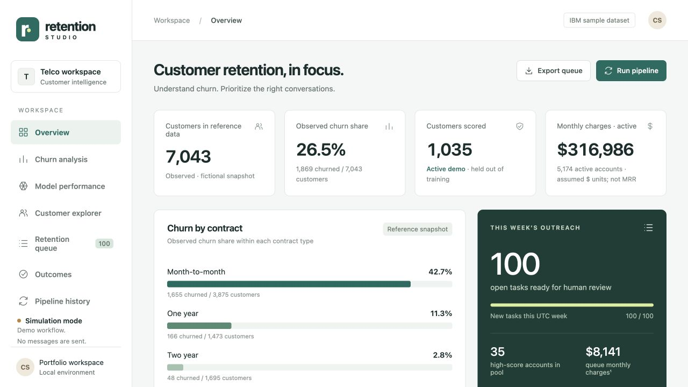

# Retention Studio

Prioritize reviewable churn retention work for **customer success analysts**.

Original topic: **Customer Churn Prediction** from [the source post](https://www.instagram.com/p/DdyMaogE4ud/).

> Local portfolio implementation developed with Codex assistance. Measured results and limitations are documented; no production adoption, revenue or hiring outcome is claimed.



## What works

- Calibrated models
- eligibility rules
- budget
- audited task queue

[Example output](reports/example-output.json) · [Recorded checks](reports/test-results.txt) · [Learning and interview guide](LEARNING_GUIDE.md)

## Start

Python 3.12 is the validated Python runtime. Run commands from this repository directory. Windows users activate `.venv\Scripts\activate` instead of `source`.

```sh
python3.12 -m venv .venv
source .venv/bin/activate
python -m pip install -r requirements-lock.txt
python -m pip install --no-deps -e .
retention bootstrap
retention serve --port 8080
```

Open **http://127.0.0.1:8080**. Keep the process running. Use `--port` to select another port. The Python development servers are intended for local demonstrations.

## Demonstration

Bootstrap from raw sample data, start the dashboard, inspect model evaluation, score the active sample, assign a task and review its audit history. Repeat the same score input to verify idempotency.

## Architecture and decisions

Raw IBM sample → validated split/model pipeline → scoring and eligibility → transactional SQLite workflow → Flask dashboard.

Stack: pandas · scikit-learn · Flask.

1. Use disjoint train/validation/holdout partitions and fit preprocessing inside the model pipeline.
2. Eligibility, cooldown and weekly capacity are operational constraints applied after scoring.
3. SQLite transactions, idempotency keys and an audit trail protect repeated scoring runs and task changes.

## Verification

```sh
python -m pytest -q
```

See [VERIFICATION.md](VERIFICATION.md) for actual executed checks, setup verification, model/data results and any outstanding environment limitations. The [recorded CI runs](reports/ci-verification.json) passed for the linked source revision.

## Data and attribution

IBM fictional telecom sample. See [DATA_AND_SOURCES.md](DATA_AND_SOURCES.md) for provenance and usage notes. Original project code is MIT unless a preserved source file or dependency states otherwise. Model and third-party data licenses remain separate.

## Limitations and next improvement

IBM data describe fictional undated telecom customers. Historical churn labels do not validate a future prediction horizon. Tasks and outcomes are simulation-only; no CRM messages, account changes or realized savings are claimed.

Suggested extension: Add one eligibility rule to config/playbook.yaml and test its interaction with weekly capacity and cooldown.

## Honest portfolio use

This implementation and documentation were developed with substantial Codex assistance. Before presenting it, run the demonstration, explain the design choices, and complete the suggested independent modification. Do not describe generated code as work experience, an accepted upstream contribution, or a deployed production service.
