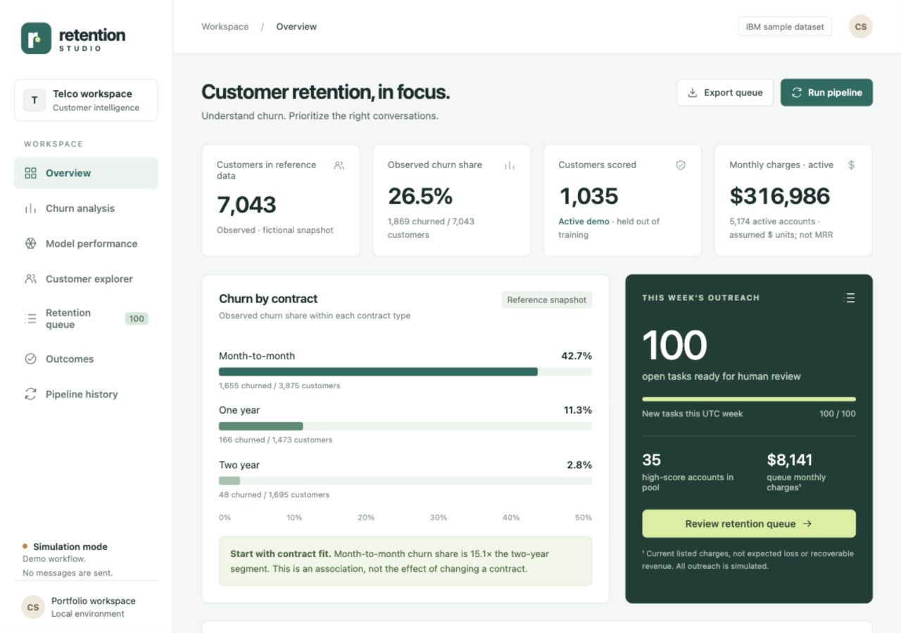
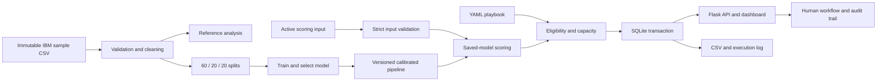
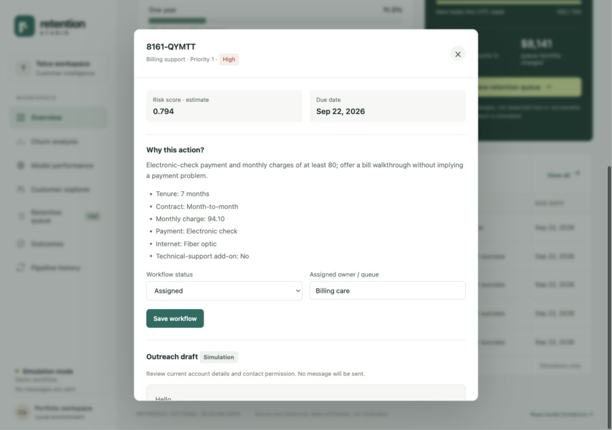
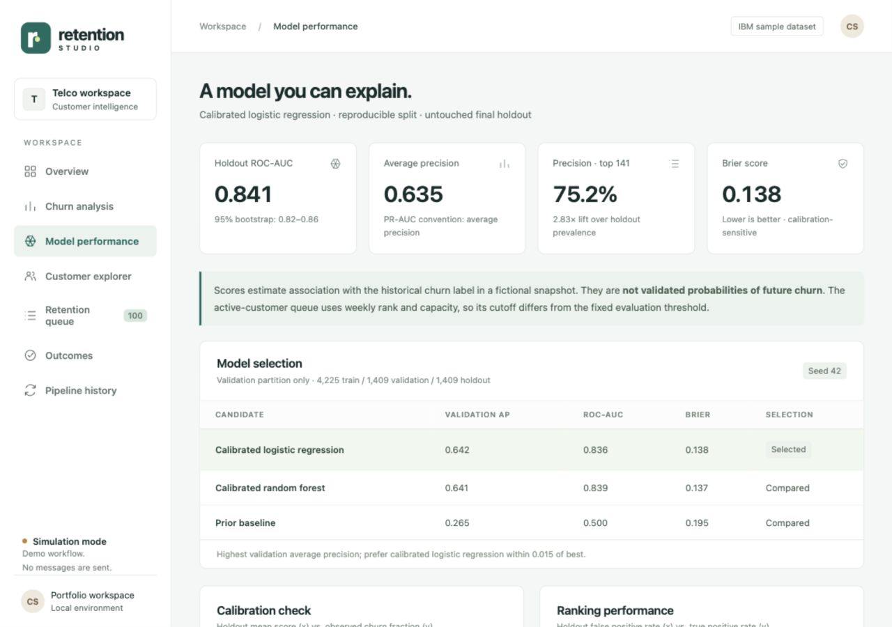

# Retention Studio

A complete **Customer Churn Analysis and Automated Retention Playbook** portfolio project: public sample data → validation → analysis → calibrated model → prioritized tasks → audited workflow → honest outcome tracking.

**Local dashboard: http://127.0.0.1:8766/** · Simulation only · No paid services required.



## Start locally

Python 3.12+ is required by the exact dependency lock (verified on Python 3.12). From this project directory:

```bash
python3 -m venv .venv
source .venv/bin/activate
export PYTHONPATH="$PWD/src${PYTHONPATH:+:$PYTHONPATH}"
python -m pip install -r requirements-lock.txt
python -m pip install --no-deps -e .
retention bootstrap
retention serve --port 8766
```

Open **http://127.0.0.1:8766/**. Keep the terminal running. Stop it with Ctrl+C. If the port is occupied, pass another `--port` and use that URL. The project delivered on this computer already has an environment, trained artifacts, and a populated database; to restart it, run `./start.sh`.

Bootstrap trains only when `artifacts/current.json` is absent, generates reports, then scores the demo input. Original public sample data is bundled; no network or account is needed after dependency installation. A clean Git clone regenerates ignored model binaries and derived CSVs during bootstrap.

## Commands

```bash
retention train                         # explicit retraining and final evaluation
retention score                         # routine saved-model scoring; no retraining
retention score --input path/to/new.csv # validate, score, recommend, persist, log, export
retention report                        # regenerate reports from saved results
python -m pytest -q                     # test isolated temporary databases
python scripts/download_data.py        # optional checksum-verified pinned download
```

Equivalent without package installation: `PYTHONPATH=src .venv/bin/python -m retention.cli COMMAND`.

## What works

- **Data:** strict schema, category, numeric, consistency, missingness, and customer uniqueness checks; original raw data preserved; separate cleaned reference, train/validation/holdout splits, and target-free scoring inputs.
- **Analysis:** explicit denominators for contracts, tenure, charges, payment method, internet service, and subscribed technical support; Wilson intervals and small-segment warnings.
- **Model:** prior baseline versus calibrated logistic regression and random forest; stratified 60/20/20 split, fold-local preprocessing/calibration, validation-only selection, final holdout metrics, reliability curve, permutation importance, saved pipeline and version metadata.
- **Retention:** configurable eligibility/rules, 100-task weekly budget by default, stable prioritization, exclusion list, 30-day cooldown, one open task per account, due dates, assigned queues, safe review drafts, audited statuses.
- **Automation:** one scoring command, transactional SQLite updates, content/model/config idempotency, CSV exports, execution logs, upload validation, preservation of the last successful snapshot on failure.
- **Dashboard:** overview, segment analysis, model evaluation, searchable customer explorer, editable queue, explicitly simulated outcomes, pipeline history, loading/error/empty states, responsive layouts.

The [analysis report](reports/ANALYSIS.md), [model evaluation](reports/MODEL_EVALUATION.md), [data dictionary](DATA.md), [demonstration walkthrough](DEMO.md), [interview notes](INTERVIEW.md), and [three resume bullets](reports/RESUME_BULLETS.md) explain the implementation.

## Architecture



Python/pandas/scikit-learn handle data and modeling. Flask serves a same-origin API and lightweight HTML/CSS/JavaScript dashboard; charts are local SVG/CSS with no CDN. SQLite stores runs, idempotency keys, scored snapshots, tasks, audit events, and outcomes. YAML stores business assumptions. There is no external AI API: personalized drafts are deterministic and grounded in available fields.

```text
config/playbook.yaml         Editable rules, capacity, exclusions, cooldown, risk bands
data/raw/                   Original CSV, source manifest, original license
data/processed/              Cleaned reference snapshot (generated)
data/training/               Train, validation, holdout CSVs + split manifest
data/scoring/                Target-free held-out active demonstration pool
artifacts/<model-version>/   Complete pipeline and evaluation metadata
src/retention/               Data, model, playbook, persistence, pipeline, API, CLI
static/ + templates/        Dashboard, styling, and local charts
tests/                      Validation, modeling, workflow, and API tests
reports/                    Analysis, model summary, evidence, screenshots, resume
var/retention.sqlite         Local operational state (ignored by Git)
var/runs/<run-id>/           Processed scores, CSV queue, execution log, unsent summary
```

## Business assumptions and boundaries

The source is IBM's **fictional, undated telecom sample**. Churn means the supplied `Churn = Yes` label; `No` is treated as active. Reported churn is a snapshot share, not a dated monthly rate. There is no validated future prediction horizon. Customer subscription fields are not usage telemetry; `TechSupport` describes an add-on, not incidents.

The default scoring pool contains **1,035 active holdout accounts**, separate from model training. This is a reproducible demonstration, not a new prospective cohort. No claimed outcome can be inferred from its known historical active labels.

The evaluation threshold uses a **predeclared 100 / 1,000 planning capacity**, chosen from validation scores. Live queue selection instead ranks eligible customers within a global UTC-week capacity. The run records its actual cutoff. Probability calibration is checked, but scores remain historical-label estimates. See the model report for the precision/recall tradeoff.

Monthly charges are source account fields. Summed active charges are not measured MRR, loss, profit, or savings. Dollar signs are a display convention; currency is not independently established in the CSV. The value calculator exposes hypothetical improvement, contribution, and contact-cost assumptions.

## Workflow details

`New → Assigned → In Progress → Completed / Dismissed`; direct completion/dismissal is allowed from earlier open states. Closed tasks cannot reopen, preserving one open task per customer. Owner changes and every status change are audited. Optimistic timestamps prevent stale edits. Editing an outcome updates the current observation while retaining the prior value in the audit trail.

Eligibility checks run before ranking: active account, no manual exclusion, required signals present, minimum score, no open task, and contact cooldown. Tasks reserve weekly capacity at creation, even if dismissed later. Cooldown uses the recorded contact time, or closure/update time when no contact is recorded. Consent is absent: all tasks require human verification and stay in simulation.

The same exact input bytes, model version, and full configuration fingerprint are processed only once successfully—even next week. To create a new batch, provide genuinely refreshed input. A new input cannot bypass existing open tasks, cooldowns, or weekly capacity. Whitespace-only file changes can trigger processing but cannot duplicate open tasks. SQLite serializes writers, and a partial unique index enforces one open task per customer. Failed transactions keep the previous customer snapshot and tasks.

Dashboard queue exports reflect current status. Per-run exports are immutable snapshots and can differ after subsequent edits. Files are written before the database commits; incomplete artifact folders can remain after a failure but are never marked successful. A process killed mid-run can leave a `Running` log entry; restarting/retrying is safe, but no automatic stale-run reconciliation is implemented.

## Optional local scheduling — disabled

No scheduler has been installed or enabled. On macOS/Linux, an optional personal cron entry could run every Monday at 09:00 in the machine's local timezone:

```cron
0 9 * * 1 cd /absolute/path/to/retention-studio && PYTHONPATH=src .venv/bin/retention score --input /absolute/path/to/refreshed-active.csv >> var/scheduler.log 2>&1
```

Replace paths before enabling it yourself. The computer must be awake and its scheduler running; the dashboard server need not run for scoring. The dashboard process must run to browse results. A cron entry does not fetch fresh production data; your input provider must refresh the scoring CSV. Replaying the bundled demo stays idempotent. Task capacity uses UTC Mondays, independently of the scheduler's timezone. An unsent notification summary is saved per successful run.

## Testing and screenshots

See [verification evidence](reports/VERIFICATION.md) for automated and browser checks. Tests use temporary databases and never fabricate results in the delivered queue. Screenshots are captured from the actual running application.




## Security and publication

The server binds only to `127.0.0.1`. Mutations require a session CSRF token; Host validation rejects unexpected hosts; response headers limit scripts and framing. CSV exports neutralize formula prefixes in editable text. No private customer data, API keys, names, email addresses, or credentials are bundled. Local database, uploads, and run outputs are ignored by Git. Only load locally generated/trusted joblib artifacts.

This is a single-user local application using Flask's development server. Authentication, production hosting, backups, database migrations, concurrent-user permissions, observability alerts, and a real contact integration require additional engineering. SQLite suits this small local workload; a shared production system would need stronger tenancy and operating controls. The source is prepared for GitHub; no remote repository or publication is created by setup.

## Functional vs. simulated vs. future work

| Functional now | Simulated / assumed | Requires external integration |
|---|---|---|
| Validation, training, scoring, dashboard, persisted workflow, audit, exports | Fictional source customers; review tasks and drafts; manually entered outcomes; capacity/risk policy; hypothetical value | Fresh dated production data, contact permission, email/CRM sends, real offers or account changes, realized outcomes, randomized experiment |

External messages, discounts, or account changes are never sent/applied. The application rejects disabling simulation mode because no integration is configured.
